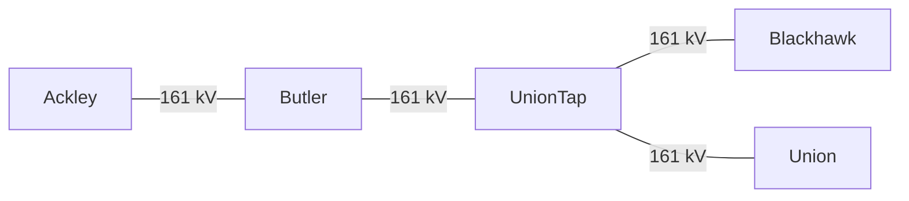

Last updated: 2025-05-14
#### Summary Characterization
Requires a bullish transmission outage to bind.
### Basic Facts
**Monitored Element:** PRAR_M_TOW11_1 1
- Common Name: Prairie Creek - Marshalltown
- Voltage: 115 kV
- Equipment Type: line
- From Bus: PRAR_CK 5139
- To Bus: M-TOWN K2 7
- From Zone: [[Alliant West|ALTW]]
- To Zone: [[Alliant West|ALTW]]
**ISO(s):** [[MISO]]
**Nearby Landmarks:** Cedar Rapids, IA
**For loss of:** ALW16058
1. DYSARTRAER16_1 1
    - Common Name: Dysart - Traer
    - Voltage: 161 kV
	- Equipment Type: line
    - From Bus: DYSART 5
    - To Bus: TRAER 5
**Direction Bound:** Eastward from Marshalltown to Prairie Creek

---
### Ratings, Flows, Generation, and Load
**Branch Ratings:**
Winter rating: 143 MW (both ratings A and B)
Summer rating: 119 MW (both ratings A and B)

**Flow Bias:**
Eastward from Marshalltown to Prairie Creek.

**Low-Side Generation:**
- Marshalltown Generating Station (706 MW, NG CC)
- Marshalltown (189 MW, NG GT)
- Vienna Wind Farm (150 MW)
- Laurel Wind Farm (123 MW)
- Ivester Wind Farm (90 MW)
- Wellsburg Wind Project (140 MW)

**High-Side Generation:**
- Prairie Creek (65 MW coal ST; 149 MW NG ST)

**Transmission Outages:**
- Belle Plaine - Toledo 161 kV
- Belle Plaine - Newhall 161 kV
- STON_PT T1 161/115 kV

**Load:**
- Cedar Rapids, IA.
---
### Binding Events and Drivers

---
### Sibling Constraints
