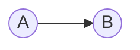

*Virtual transactions* are used by market participants to hedge against changes in [[Ex-Ante LMP]] and [[Ex-Post LMP]]s between the Day-Ahead Energy Market and the Real-Time Energy Market. Virtuals clear against the ex-ante LMP.
### Virtual Supply Offers (i.e., Increment Offers (INCs))
An hourly offer, expressed in MWh, to sell energy to the Day-Ahead Energy Market if the Day-Ahead LMP is greater than or equal to the specified offer price.
- Long DA
- Short RT
##### Submission Requirements
- MW (at least 0.1 MW)
- Location (any CPNode)
- Hours over which the offer applies
- Offer price in $/MWh (range: $-\$500/MWh$ to $\$1,000/MWh$)
- Up to 9 (MW, Price) blocks are allowed per offer
---
### Virtual Demand Bids (i.e., Decrement Bids (DECs))
An hourly bid, expressed in MWh, to buy energy from the Day-Ahead Energy Market if the Day-Ahead LMP is less than or equal to the specified bid price.
- Short DA
- Long RT
##### Submission Requirements
- MW (at least 0.1 MW)
- Location (any CPNode)
- Hours over which the bid applies
- Bid price in $/MWh (range: $-\$500/MWh$ to $\$2,000/MWh$)
- Up to 9 (MW, Price) blocks are allowed per bid
---
### Valid Locations
Virtual transactions can be submitted at any commercial pricing node (CPNode) within the [[MISO]] footprint. This includes:
- All generation nodes
- All load nodes
- All interfaces
- All load zones
- All hubs

---
### System Lambda DA/RT Spread Drivers
The system lambda DA/RT spread is primarily driven by macroeconomic supply and demand forecast misses. If the ISO *over-commits* generation resources in the DAM, then RT prices will realize lower than DA prices to send signals to plants to ramp down. Alternatively, if the ISO *under-commits* generation resources in the DAM, then RT prices will realize higher than DA prices to send signals to plants to ramp up.

Caveats and asymmetries arise depending upon the state of the generation stack. Suppose, as an idealized yet instructive example, that only baseload-serving units are committed in the DAM. Such units have low short run marginal costs of production and relative inflexibility to ramp up or down. In this case, if the ISO over-commits generation resources, then, due to these units' price-inelasticity of supply, RT prices must fall well below DA clears in order to incentivize such units to ramp down.

**Over-committed Baseload Units:** risk of $RT << DA$.

Now, suppose that the ISO under-committed generation. Then, higher cost quick-start units will need to provide the necessary supply. RT prices will realize higher than DA clears in order to incentivize such units to ramp up.

**Under-committed Supply, Thin Stack:** risk of $RT >> DA$.

---
### Stack Model
**Objective:** high-level system-lambda model to serve as an identifier of tight periods that can be subsequently explored with congestion-driven analyses and forecasting.
**Associated Trading Approach:** target aggregates, which are more closely correlated with system lambda. Over time, layer in more of a congestion view, unlocking opportunities at finer levels of spatial granularity.
#### 1. Load Forecast Model
- Decide on an appropriate level of spatial granularity.
- Lean on Meteologica.
- Use state-estimator data to train a model for specific aggregates.
#### 2. Renewable Generation Forecast Model
- Decide on an appropriate level of spatial granularity.
- Lean on Meteologica.
- Use state-estimator data to train a model for specific generator groupings.
#### 3. ISO Load Forecast Miss Model
- Features: weather, lagged load, lagged load forecast misses (in case ISO overcorrects or does not correct their forecast misses).
#### 4. ISO Renewable Generation Forecast Miss Model
- Features: weather, lagged load, lagged renewable generation forecast misses (in case ISO overcorrects or does not correct their forecast misses).
#### 5. Generation Outages Model
- Make use of MISO's planned outage data. Forecast unplanned outages. The sum of planned outages and unplanned outages constitutes our *total outage capacity forecast.*
- Start with the units that are known to be on outage. Remove these from the stack. Subtract the outage capacities associated with these known outages from our total outage capacity forecast. Remove units that are known to be running from the remainder of the stack, yielding the *outage-eligible stack*. Apportion the remaining outage capacity intelligently across the outage-eligible stack.
- As there is inherent uncertainty and the result is often impactful, apportionment described in the preceding bullet should give rise to different scenarios. Aim for a *bearish bound scenario* (outages are primarily apportioned across peakers) and a *bullish bound scenario* (outages are primarily apportioned across baseload-serving generation.
#### 6. Imports Forecast Model
?
#### 7. Stack Representation
- Energy Velocity
- PROBE
- Offer curve unmasking
- Offer curve sensitivity to fuel price
#### 8. Shift Factor Characterization for Aggregates
- Which fuel types, prime movers are most impactful for each aggregate? Are some aggregates heavily dependent upon wind generation, solar generation, etc.?
---
### Statistical Context
**Objective:** maintain awareness of our key statistics' empirical distributions and time series properties.
**Approach:** visualization tools and summary statistics in interactive Plotly Dash applications.
#### DA/RT Spreads
- Use Yes energy to identify largest DA/RT spreads. Eventually, we could build a more tailored application.
#### ISO Load Forecast Misses
- Under which conditions does the ISO tend to miss load forecasts low/high?
- Are there autocorrelations in the ISO's load forecast misses?

#### ISO Renewable Generation Forecast Misses
- Under which conditions does the ISO tend to miss wind/solar generation forecasts low/high?
- Are there autocorrelations in the ISO's wind/solar generation forecast misses?
#### Offer Curves
- Are there autocorrelations in generators' offer curves? How does such autocorrelation vary across units by fuel, prime mover, etc.?
### Tools to Provide Statistical Context
We should develop a time series forecast miss visualization and analytics template. This can then be applied to study forecast accuracy trends, seasonality, etc. of ISO models, vendor models, and our own models.
#### Forecast Miss Analysis and Visualization Template
- Time series component that visualizes forecast misses over time: (1) autocorrelation structures, (2) seasonality.
- Use Nixtla and time series models (neural networks in `NeuralForecast`, XGBoost, others in `MLForecast`, AutoARIMA in `StatsForecast`) to predict forecast errors. These should be relatively naive models without exogenous variables. For specific applications, we'll want custom models that do make heavy use of exogeneous variables to predict forecast errors (e.g., predicting ISO load misses).

**Applications:**
- ISO, Meteologica load forecast, renewable generation forecast vs. actual values.

---
### Trading Approach
#### View Formation
1. Stack model-informed view of system lambda.
2. Manual mixing of congestion signals to layer on a congestion view.
3. Layer in more sophisticated production cost models over time. We need to be able to walk before we can run.
##### Distributional View Formation
- Reason backwards: for each aggregate, which constraints are bullish/bearish?
- System lambda: base value + broad skew; congestion: skew fine-grained skew.
#### Opportunity Quality Classification
*We will pursue a heavy DEC bias due to the statistical properties (skew, tail mass) of the price distributions.*
##### Decrement Bids: Short DA, Long RT
1. **Ideal DEC**
    - Can be bought in the DAM below the system lambda P50 RT price forecast.
    - Enjoys system lambda and congestion positive skew.
2. **Attractive DEC**
    - Can be bought in the DAM at the system lambda expected value RT price forecast.
    - Enjoys system lambda and congestion positive skew.
3. **Valid DEC**
    - Can be bought in the DAM marginally above the system lambda expected value RT price forecast.
    - Enjoys clear system lambda and congestion positive skew.
##### Incremental Offers: Long DA, Short RT
1. **Ideal INC**
    - Can be sold in the DAM above the system lambda P50 RT price forecast.
    - Enjoys system lambda and congestion negative skew.
    - Rare due to the fact that system lambda often has positive skew.
2. **Attractive INC**
    - Localized, congestion-driven opportunity.
    - Can be sold in the DAM *well above* the RT LMP's expected value.
    - Short, thin positive tail in RT price distribution.
3. We avoid defining a *Valid INC* class, as the risks inherent with the contract necessitate that a sufficiently strong confidence buffer is present. We shall only purchase INCs when the opportunity is clear.
#### Greedy Algorithmic Approach
*Prioritize the most impactful*
1. Focus on system lambda.
2. Find constraints whose siblings have contingencies on outage.
3. It's always worth a try to go after what's obvious even if we don't clear.
4. Most value will lay in long exposure to tail events that have yet to take place.
5. Find the pricing nodes (and aggregates) that are "long everything" or "short everything."
#### Safe DEC Nodes
*Where is the congestion risk skew in our favor for going long?*
- Identify those nodes that are on the high side of the vast majority of constraints that have recently bound.
- Alternatively, identify those nodes that are on the high side of the vast majority of constraints that we expect could bind.
- Useful filtering approach for defining a universe of candidate nodes at which to enter into DECs.
#### Safe INC Nodes
*Where is the congestion risk skew in our favor for going short?*
- Identify those nodes that are on the low side of the vast majority of constraints that have recently bound.
- Alternatively, identify those nodes that are on the low side of the vast majority of constraints that we expect could bind.
- Useful filtering approach for defining a universe of candidate nodes at which to enter into INCs.
#### Aggregates Focus with Pragmatic Accents
- Aggregates more closely follow system lambda.
- Mirrors our view formation approach.
- Define the aggregates we want to consider *a priori*, then train models for each such aggregate.
- If there's a clear opportunity that is only partially addressed by our in-place models, then perform *ad hoc* analyses, and trade pragmatically. This is particularly true with ongoing events.
#### Bidding Behavior
- Target a 3:1 ratio of DEC positions to INC positions. DECs are typically long skew/tail events; INCs are typically short skew/tail events. Don't get caught picking up pennies in front of an oncoming freight train. When buying INCs, we want to find those that have thin, abbreviated tail risk. When buying DECs, we can be more liberal.
- Keep costs low. Subject to low costs, don't be shy to go long, especially before an event begins.
- Harvest short value as clear drivers conclude.

---
### Distributional Theme
When assigning a fair value to a tradable asset, it's necessary to consider a distributional view (as opposed to a point-estimate). Variance, skewness, kurtosis, and higher moments are critical to consider. This is particularly true in the case of power and natural gas markets, for significant mass lies in the tails of the distributions that arise in this setting.

When a distribution has sufficient mass in at least one of its tails, the underlying random variable's expected value is highly sensitive to anomalous events. In such settings, the skew and asymmetry associated with the random variable's distribution are as important as its expected value. Indeed, if rare events are highly influential and rare events (by the definition of rarity) are not well represented in training data (and are thus difficult to predict with much specificity), then one must be cognizant of the asymmetry of models' error terms.
#### Conditional Distribution Approach
By definition, the value of a cleared increment offer at a given location and associated with a given hour is the difference between that hour's day-ahead and real-time [[Locational Marginal Price]]s at the location. Analogously, the value of a cleared decrement bid at the same location and for the same hour is $-1$ times the value of the corresponding cleared increment offer. That is, the value of the decrement bid is the difference between that hour's real-time and day-ahead LMPs at the location.

The key adjective in the above is "cleared." If one's increment offer is greater than the corresponding DA [[Ex-Ante LMP]], then the offer fails to clear, and one does not accrue a position. Analogously, if one's decrement bid is less than the corresponding DA [[Ex-Ante LMP]], the bid fails to clear, and one does not accrue a position. As such, when analyzing virtuals, we are not interested in merely the DA/RT spread. Rather, we are interested in this spread *conditioning on the DA clearing price*. Thus, we are interested in the [conditional probability distribution](https://en.wikipedia.org/wiki/Conditional_probability_distribution) of RT [[Ex-Post LMP]] given a DA [[Ex-Ante LMP]].
##### Formal Notation
Fix an arbitrarily chosen CPNode as well as an arbitrarily chosen hour. With the CPNode and hour pinned down, we can restrict attention to a single DA price and a single RT price.

Let the random variable $Y \in \mathbb{R}$ denote the real-time LMP for the location and hour under consideration, let $\Theta \in \mathbb{R}$ denote the day-ahead LMP for the same location and hour, and let $X \in \mathbb{R}^n$ denote a random vector of exogenous variables. Then, our objective is to model the distribution $f_{Y|X, \Theta} (y | x, \theta)$.
##### Commentary
Suppose that we are considering an increment offer for a given CPNode and hour. Then, the difference between DA and RT price, $INC := \theta - f_{Y|X, \Theta} (y | x, \theta)$, represents the value of a cleared increment offer. Thus, our objective is to choose $\theta'$ such that if $\theta' \ge \theta$ (i.e., if our increment offer clears), then the distribution associated with the random variable $INC = \theta - f_{Y|X, \Theta} (y | x, \theta)$ has attractive expected value, variance, skew, etc.

Alternatively, suppose that we are considering a decrement bid for a given CPNode and hour. Then, the difference between RT and DA price, $DEC := f_{Y|X, \Theta} (y | x, \theta)$, represents the value of a cleared decrement bid. In this case, our objective is to choose $\theta'$ such that if $\theta' \le \theta$ (i.e., if our decrement bid clears), then the distribution associated with the random variable $DEC = f_{Y | X, \Theta} (y | x, \theta)$ has attractive expected value, variance, skew, etc.

---
### Locational spreads
Consider the following path, which may contain intermediate nodes:

Rather than expressing a view on $A$'s real-time LMP vs. its day-ahead LMP and $B$'s real-time LMP vs. its day-ahead LMP, suppose that we wish to express a view of $A$ relative to $B$. There are two two-legged strategies to express such a view. Below, we provide several equivalent expressions of the payoff formulae for these two strategies. The different expressions make it possible to conceptualize the payoff formulae from a few different perspectives.

There is noteworthy clearing risk with such two-legged strategies -- it might be the case that only one leg clears and one's position is not as one intended. It's possible, however, to offer the INC at the minimum price and bid the DEC at the maximum price to ensure that both legs clear. If this approach is taken, then one is a pure price taker, and the aforementioned conditional distribution approach loses relevance. We don't expect to deploy such an approach (especially early in our virtuals trading career).

#### 1. INC at $A$, DEC at $B$
$$\begin{align} \text{Payoff} &= DA_A - RT_A + RT_B - DA_B\\ &= RT_B - RT_A + DA_A - DA_B\\ &= RT_B - RT_A - (DA_B - DA_A).\end{align}$$
Obtaining an INC at $A$ and a DEC at $B$ is profitable if and only if RT congestion along the $A \rightarrow B$ path is greater than DA congestion along the $A \rightarrow B$ path.
#### 2. DEC at $A$, INC at $B$
$$\begin{align} \text{Payoff} &= RT_A - DA_A + DA_B - RT_B\\ &= DA_B - DA_A + RT_A - RT_B\\ &= DA_B - DA_A - (RT_B - RT_A).\end{align}$$
Obtaining a DEC at $A$ and an INC at $B$ is profitable if and only if DA congestion along the $A \rightarrow B$ path is greater than RT congestion along the $A \rightarrow B$ path.

___