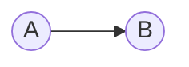

*Virtual transactions* are used by market participants to hedge against changes in [[Ex-Ante LMP]] and [[Ex-Post LMP]]s between the Day-Ahead Energy Market and the Real-Time Energy Market. Virtuals clear against the ex-ante LMP.
### Virtual Supply Offers (i.e., Increment Offers (INCs))
An hourly offer, expressed in MWh, to sell energy to the Day-Ahead Energy Market if the Day-Ahead LMP is greater than or equal to the specified offer price.
##### Submission Requirements
- MW (at least 0.1 MW)
- Location (any CPNode)
- Hours over which the offer applies
- Offer price in $/MWh (range: $-\$500/MWh$ to $\$1,000/MWh$)
- Up to 9 (MW, Price) blocks are allowed per offer
---
### Virtual Demand Bids (i.e., Decrement Bids (DECs))
An hourly bid, expressed in MWh, to buy energy from the Day-Ahead Energy Market if the Day-Ahead LMP is less than or equal to the specified bid price.
##### Submission Requirements
- MW (at least 0.1 MW)
- Location (any CPNode)
- Hours over which the bid applies
- Bid price in $/MWh (range: $-\$500/MWh$ to $\$2,000/MWh$)
- Up to 9 (MW, Price) blocks are allowed per bid
---
### Valid Locations
Virtual transactions can be submitted at any commercial pricing node (CPNode) within the [[MISO]] footprint. This includes:
- All generation nodes
- All load nodes
- All interfaces
- All load zones
- All hubs

---
### Distributional Approach
When assigning a fair value to a tradable asset, it's necessary to consider a distributional view (as opposed to a point-estimate). Variance, skewness, kurtosis, and higher moments are critical to consider. This is particularly true in the case of power and natural gas markets, for significant mass lies in the tails of the distributions that arise in this setting.

When a distribution has sufficient mass in at least one of its tails, the underlying random variable's expected value is highly sensitive to anomalous events. In such settings, the skew and asymmetry associated with the random variable's distribution are as important as its expected value. Indeed, if rare events are highly influential and rare events (by the definition of rarity) are not well represented in training data (and are thus difficult to predict with much specificity), then one must be cognizant of the asymmetry of models' error terms.
#### Conditional Distribution Approach
By definition, the value of a cleared increment offer at a given location and associated with a given hour is the difference between that hour's day-ahead and real-time [[Locational Marginal Price]]s at the location. Analogously, the value of a cleared decrement bid at the same location and for the same hour is $-1$ times the value of the corresponding cleared increment offer. That is, the value of the decrement bid is the difference between that hour's real-time and day-ahead LMPs at the location.

The key adjective in the above is "cleared." If one's increment offer is greater than the corresponding DA [[Ex-Ante LMP]], then the offer fails to clear, and one does not accrue a position. Analogously, if one's decrement bid is less than the corresponding DA [[Ex-Ante LMP]], the bid fails to clear, and one does not accrue a position. As such, when analyzing virtuals, we are not interested in merely the DA/RT spread. Rather, we are interested in this spread *conditioning on the DA clearing price*. Thus, we are interested in the [conditional probability distribution](https://en.wikipedia.org/wiki/Conditional_probability_distribution) of RT [[Ex-Post LMP]] given a DA [[Ex-Ante LMP]].
##### Formal Notation
Fix an arbitrarily chosen CPNode as well as an arbitrarily chosen hour. With the CPNode and hour pinned down, we can restrict attention to a single DA price and a single RT price.

Let the random variable $Y \in \mathbb{R}$ denote the real-time LMP for the location and hour under consideration, let $\Theta \in \mathbb{R}$ denote the day-ahead LMP for the same location and hour, and let $X \in \mathbb{R}^n$ denote a random vector of exogenous variables. Then, our objective is to model the distribution $f_{Y|X, \Theta} (y | x, \theta)$.
##### Commentary
Suppose that we are considering an increment offer for a given CPNode and hour. Then, the difference between DA and RT price, $INC := \theta - f_{Y|X, \Theta} (y | x, \theta)$, represents the value of a cleared increment offer. Thus, our objective is to choose $\theta'$ such that if $\theta' \ge \theta$ (i.e., if our increment offer clears), then the distribution associated with the random variable $INC = \theta - f_{Y|X, \Theta} (y | x, \theta)$ has attractive expected value, variance, skew, etc.

Alternatively, suppose that we are considering a decrement bid for a given CPNode and hour. Then, the difference between RT and DA price, $DEC := f_{Y|X, \Theta} (y | x, \theta)$, represents the value of a cleared decrement bid. In this case, our objective is to choose $\theta'$ such that if $\theta' \le \theta$ (i.e., if our decrement bid clears), then the distribution associated with the random variable $DEC = f_{Y | X, \Theta} (y | x, \theta)$ has attractive expected value, variance, skew, etc.

---
### Locational spreads
Consider the following path, which may contain intermediate nodes:

Rather than expressing a view on $A$'s real-time LMP vs. its day-ahead LMP and $B$'s real-time LMP vs. its day-ahead LMP, suppose that we wish to express a view of $A$ relative to $B$. There are two two-legged strategies to express such a view. Below, we provide several equivalent expressions of the payoff formulae for these two strategies. The different expressions make it possible to conceptualize the payoff formulae from a few different perspectives.

There is noteworthy clearing risk with such two-legged strategies -- it might be the case that only one leg clears and one's position is not as one intended. It's possible, however, to offer the INC at the minimum price and bid the DEC at the maximum price to ensure that both legs clear. If this approach is taken, then one is a pure price taker, and the aforementioned conditional distribution approach loses relevance.

#### 1. INC at $A$, DEC at $B$
$$\begin{align} \text{Payoff} &= DA_A - RT_A + RT_B - DA_B\\ &= RT_B - RT_A + DA_A - DA_B\\ &= RT_B - RT_A - (DA_B - DA_A).\end{align}$$
Obtaining an INC at $A$ and a DEC at $B$ is profitable if and only if RT congestion along the $A \rightarrow B$ path is greater than DA congestion along the $A \rightarrow B$ path.
#### 2. DEC at $A$, INC at $B$
$$\begin{align} \text{Payoff} &= RT_A - DA_A + DA_B - RT_B\\ &= DA_B - DA_A + RT_A - RT_B\\ &= DA_B - DA_A - (RT_B - RT_A).\end{align}$$
Obtaining a DEC at $A$ and an INC at $B$ is profitable if and only if DA congestion along the $A \rightarrow B$ path is greater than RT congestion along the $A \rightarrow B$ path.